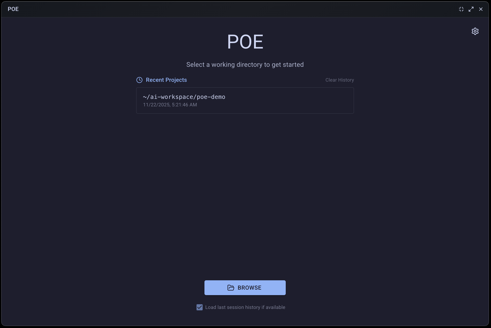
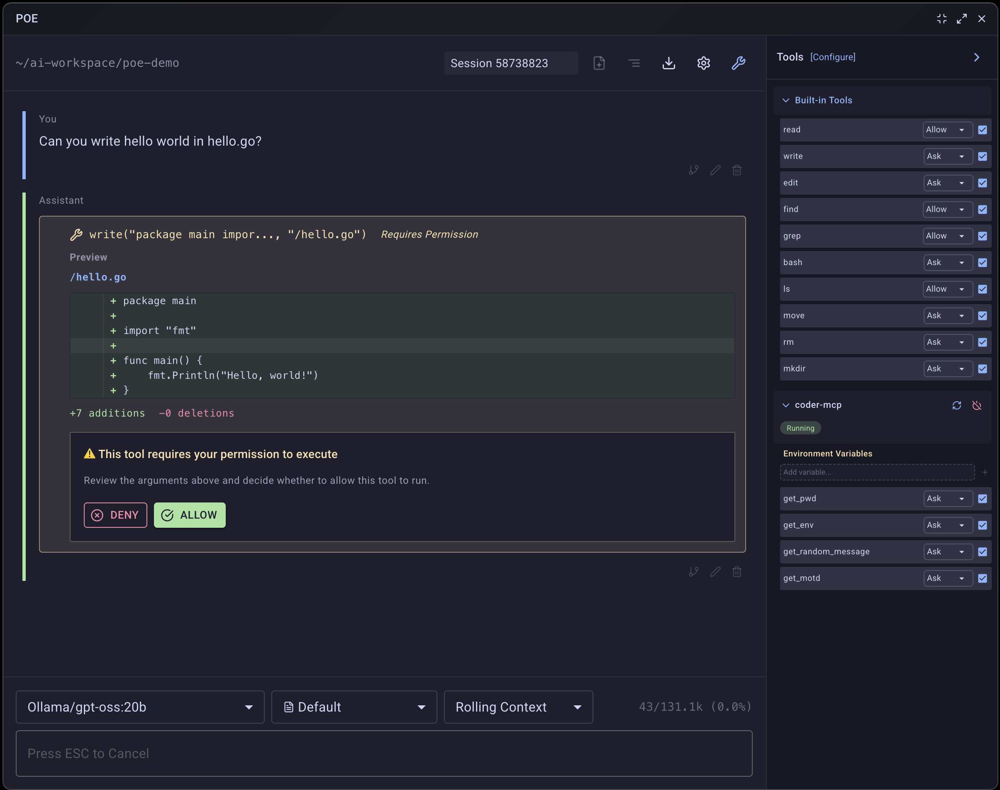

# Poe

An AI chat tool designed for ad-hoc inference.





**Features**

- Rolling or halting context windows.
- Hot swappable prompts.
- Read/Write/Find utilities (restricted to the project directory).
- Local MCP Server support (started in the project directory).
- Defaults to "Ask" for potential write operations.
- Forking sessions.
- Editing/Deleting message history.

It's everything you could love in a CLI coding agent, but for the desktop.

What is the working directory of my chat? I run Poe, so it's right there in the window for me to see!

## Project Status

This was all vibe coded and is in active development.

Right now the focus is on just demonstrating what an Desktop AI chat could be.

Despite only supporting Ollama and LM Studio API explicitly, I want to figure something out so it supports every provider under the sun.

Some future feature prospects might include:

- Terminal commands like `!command goes here` to pre-populate contexts.
- Popup editor to change change suggestions before they are written.
- Message queuing.
- MCP Pre and Post hook processing (experimental hack).

Contributions welcome, sorry the codebase sucks to read though.
The entire app was vibe coded.

## Development

Running development build with Vite/React hot reloading.

```
npm run dev
```

Build for production. Final builds will be in `release/`.

```
npm run electron:pack -- --mac --win --linux
```

Clean project directory.

```
npm run clean
```

Running specific script in isolation.

```
npm run exec electron/database.ts
```
